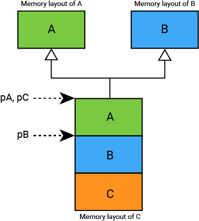
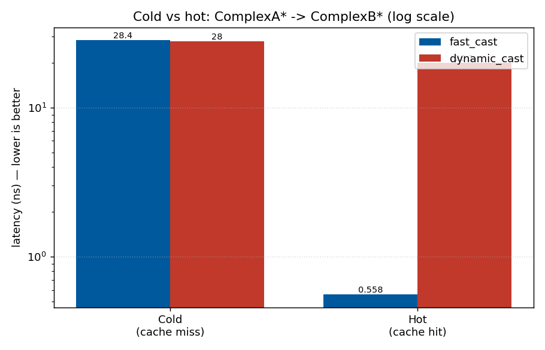
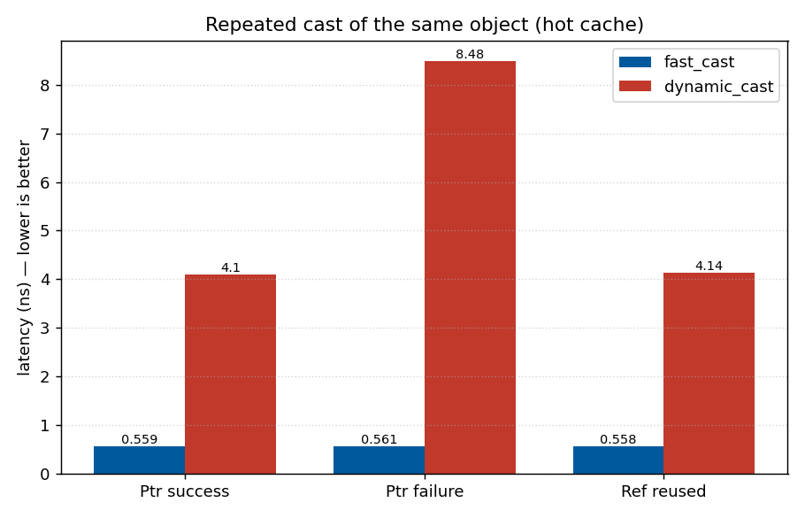
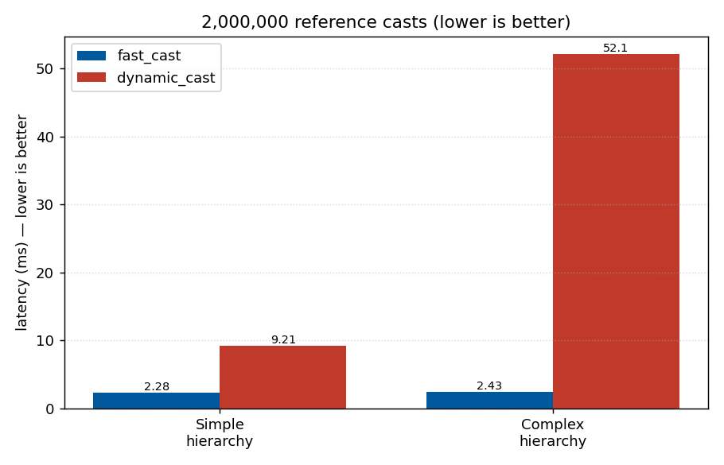

[](https://github.com/reach2sayan/FastCast/actions/workflows/action.yml) [](#)

# FastCast

**`fast_cast`** is a modern C++ header-only library providing a **high-performance polymorphic cast** alternative to
`dynamic_cast`. It accelerates runtime type conversions in polymorphic hierarchies while maintaining safety and
correctness.

The code is heavily inspired by [FastDynamicCast](https://github.com/tobspr/FastDynamicCast). This is effectively a
modern C++ implementation of FastDynamicCast. This is the basic idea in a single image



Also read [this reddit post.](https://www.reddit.com/r/cpp/comments/ilbf1y/vtable_layout_differences_between_itanium_and)

# Improvements from FastDynamicCast

The library also includes **compile-time optimizations**:

- If a cast can be resolved with `static_cast` or identity, it avoids any runtime overhead.
- Failed casts are cached to reduce repeated dynamic lookups.

---

## Features

- Pointer, reference, and `std::shared_ptr` casting.
- **Fast paths** for:
    - Exact types (identity cast)
    - `static_cast`-safe conversions
- **Dynamic path** with per-thread vtable offset caching.
- **Failed cast caching** for repeated misses.
- Header-only, lightweight, and requires only C++17+ (C++23 constexpr enhancements included).
- Works with complex inheritance, including multiple and virtual inheritance.

---

## Installation

Simply include the header in your project:

```cpp
#include "fastcast.hpp"
```

No linking is required.

## Usage

### Pointer Casting

```cpp
struct Base { virtual ~Base() = default; };
struct Derived : Base {};

Derived d;
Base* bp = &d;

Derived* dp1 = fast_cast<Derived*>(bp); // fast_dynamic_cast equivalent
```

### Reference Casting

```cpp
Derived d;
Base& br = d;

try {
    Derived& dr = fast_cast<Derived&>(br); // throws std::bad_cast on failure
} catch (const std::bad_cast& e) {
    std::cerr << "Invalid cast\n";
}
```

### Shared Pointer Casting

```cpp
auto sp_base = std::make_shared<Derived>();
auto sp_derived = fast_dynamic_pointer_cast<Derived>(sp_base);
```

### Identity Casting

```cpp
Derived* dp = &d;
auto same = fast_cast<Derived*>(dp); // trivial, no runtime overhead
```

## Benchmarks

Run on a 16-core 4.768 GHz CPU (mean of 5 repetitions, `-DCMAKE_BUILD_TYPE=Release`).
Reproduce with `./measure` and regenerate the plots with `benchmark/plot_results.py`
(see [the benchmark directory](benchmark/)). CPU frequency scaling was enabled, so
sub-nanosecond figures are throughput-limited and should be read as "effectively free",
not as precise latencies.

### Where the speedup comes from: the cache

`fast_cast` caches one `(vtable → offset)` entry per `(From, To)` type pair. The first
cast of a given dynamic type ("cold") falls through to a real `dynamic_cast` plus the
caching bookkeeping; every **subsequent** cast of that same type ("hot") is just a load
and a pointer adjustment. The honest comparison therefore has two regimes:



| `ComplexA* → ComplexB*` | fast_cast | dynamic_cast |
|-------------------------|-----------|--------------|
| **Cold** (cache miss, varying types) | 28.4 ns | 28.0 ns |
| **Hot** (cache hit, repeated type)   | 0.56 ns | 20.1 ns |

On a cold call `fast_cast` is **~as fast as (marginally slower than) `dynamic_cast`** —
it does the same `dynamic_cast` and then records the result. The win is entirely in the
hot path, where it is ~35–50× faster. If your workload casts wildly varying dynamic
types and never repeats, `fast_cast` is not faster than `dynamic_cast`.

### Hot-path latency (repeated casts of the same object)

Most real call sites cast the same handful of objects/types repeatedly, which keeps the
cache hot:



| Per call (hot)          | fast_cast | dynamic_cast |
|-------------------------|-----------|--------------|
| Pointer success         | 0.56 ns   | 4.11 ns      |
| Pointer failure         | 0.56 ns   | 8.49 ns      |
| Reused reference        | 0.56 ns   | 4.14 ns      |

Failure caching makes repeated *misses* just as cheap as hits.

### Throughput (2,000,000 reference casts, including object construction)



| 2,000,000 casts         | fast_cast | dynamic_cast |
|-------------------------|-----------|--------------|
| Simple hierarchy        | 2.28 ms   | 9.21 ms      |
| Complex hierarchy       | 2.43 ms   | 52.1 ms      |

The complex (virtual + multiple inheritance) hierarchy is where `dynamic_cast` is most
expensive and the cache pays off most.

### Static-safe path

`Derived* → Base*` is resolved at compile time, so `fast_cast`, `static_cast`, and
`dynamic_cast` all measure ~0.12 ns — identical and effectively free.

#### Observations

- Static-safe / identity casts are free, matching `static_cast`.
- A **first-time (cold)** polymorphic cast is on par with `dynamic_cast` — `fast_cast`
  adds only a small constant of bookkeeping over it.
- **Repeated (hot)** casts hit the cache and are roughly an order of magnitude faster.
- Failure caching makes repeated invalid casts as cheap as successful hot casts.

## Requirements

- C++17 minimum (C++23 optional for constexpr enhancements)
- Header-only, no linking required
- Optional: [Catch2 v2](https://github.com/catchorg/Catch2) (for tests; vendored as a single header at `tests/catch.hpp`, no fetch required), Google Benchmark (for benchmarks)
